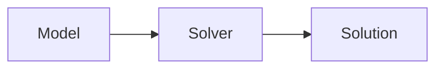

# Content Digest

Converts source material into a **layered digest**: a document engineered to be read
*instead of* watching or reading the original, at 2–3x the speed, without losing
anything that mattered.

Paths and policies come from the consuming repo's `.claude/wiki-schema.md` — see the
configuration table in `wiki_ingest`. This skill reads `wiki_root`, `derived_dir`, and
`domains`.

## Where this sits

This skill does not acquire sources. Getting material into the wiki — downloading,
transcribing recordings, writing the source page — is `wiki_ingest`'s job, and that
includes transcript capture. This skill starts from what is already in the wiki and
produces something readable from it.

So the first question is always whether the material is ingested yet:

- **Already in the wiki** — go straight to Step 1.
- **New sources supplied with the request** (video links, a paper, a deck) — invoke
  `wiki_ingest` on them first, once per source, and let it finish. It will obtain any
  transcript, write the source page, and create the concept and entity pages. Then
  come back here.

Do not duplicate ingest's work by hand, and do not write a second source page for
material it has already filed.

---

## The governing principle

Follow the repo's writing style guide at `CLAUDE.md` for voice, sentence construction, and
formatting. It applies to digest prose. The rules below govern *what goes in* a digest; that
file governs *how it reads*.

**Restructure, don't compress.**

Lectures run ~130 wpm; reading runs 250+. A *full-fidelity* linear document already
beats watching by 2–3x before a single word is cut. Cutting is where fidelity dies,
and you don't need to cut to get the speedup.

So: never summarise a worked example, an algorithm trace, or a formal definition.
Reproduce them. Compress only redundancy — restated points, admin chatter, filler.
Length is not the enemy; unstructured length is.

Three rules follow from this:

1. **Prose spine, not bullets.** Bullet-shredding strips the causal and contrastive
   connective tissue ("we need heuristics *because* blind search blows up here") —
   which is exactly what transfers to unseen exam questions. Write tight paragraphs.
   Bullets are for genuine lists only: enumerated properties, algorithm steps, options.
2. **Anchor everything.** Every spine section carries slide numbers and a clickable
   timestamp. This makes not-watching *safe* — any claim you distrust is one click
   from the source. Fidelity becomes recoverable rather than lost.
3. **Surface the transcript-only material.** What the lecturer said but didn't put on
   a slide — intuitions, "this trips people up", worked reasoning, exam hints — is the
   only real reason to watch. Extract it explicitly and mark it, and the reason evaporates.

---

## Pipeline

Work through in order. Don't stop for confirmation between steps unless you hit a
genuine ambiguity — the human wants to see the full result, then discuss.

### Step 1 — Gather the material

Establish, per digest: the source page(s) in the wiki, the transcript (if the source was
a recording), the slide or paper file, and a label (`l01`, `l02`, … for lectures; a
kebab slug otherwise).

A single lecture is often **several short videos** plus one deck. Ingest handles them as
one source; digest them as one document.

If a transcript exists, `wiki_ingest` will have told you where it put it — in the wiki
under `archive-raw`, or in a scratch directory under `link-only`. Read it from there.
If the source page exists but the transcript has been cleaned up, ask rather than
re-fetching; re-running acquisition is ingest's call, not this skill's.

### Step 2 — Read the slides or paper

Use the `pdf` skill to extract text per page. Also **view** pages that carry diagrams,
state-space figures, algorithm pseudocode, or tables — those are usually the load-bearing
content in a technical subject and never survive text extraction.

Record, per slide: its number, title, and what it actually asserts. You need slide
numbers for the anchors in Step 4.

### Step 3 — Align the streams

When there are two streams — a recording and a deck — build a mapping from slide ranges
to transcript spans. The lecturer moves through the deck roughly linearly, so match on
terminology and worked-example content.

For a single-stream source such as a paper, there is nothing to align; skip to Step 4
and let the section structure of the source carry the spine.

Classify every piece of material:

| Source | Meaning | Treatment |
|---|---|---|
| Slides only | Formal definitions, notation, pseudocode | Reproduce verbatim; the deck is authoritative |
| Both | The core argument | Spine prose, slide notation + lecturer's explanation |
| Transcript only | Intuitions, asides, warnings, exam hints | Reproduce and **mark** with a `[!mic]` callout |

The transcript-only set is the highest-value output of this skill when the source is a
recording. Hunt for it deliberately.

### Step 4 — Write the digest

Write `<wiki_root>/<derived_dir>/<label>-<topic-kebab>-digest.md` following the template
below, and link it back to the source page `wiki_ingest` created.

The digest is derived material, not a source page. Ingest already wrote one page per
source; a digest is a second, longer document built from it, and giving each source two
source pages would break the indexes and the orphan checks. `.claude/wiki-schema.md` is
authoritative on frontmatter for the derived section — re-read it if unsure.

### Step 5 — Close out

- Add the digest to the relevant `index.md`, following `index_style`.
- Append to `<wiki_root>/log.md`: `## [YYYY-MM-DD] digest | <label> — <topic>`.
- Cross-link: the digest links to `[[sources/<slug>]]` and to the concept pages ingest
  created; add a link back from the source page to the digest.
- Run `wiki_lint` and resolve what it flags.

Concept and entity extraction is not your job — `wiki_ingest` did it when the source was
brought in. If the digest surfaces concepts ingest missed, say so rather than silently
creating pages; that is a signal the ingest was thin.

Mention to the user that `cue-cards` can turn the digest into a spaced-repetition
deck, but don't run it unasked.

---

## Digest template

Obsidian-native markdown throughout — callouts, LaTeX, mermaid, tables, footnotes.
No plugins required. Foldable callouts (`-` suffix) hide answers until clicked, which
is what makes the recall layer genuine retrieval practice rather than rereading.

````markdown
---
title: <Label> — <Topic>
type: material
source: [[sources/<slug>]]
date: <YYYY-MM-DD>
domain: <required when `domains` is non-empty; omit otherwise>
tags: [<topic>, ...]
status: complete
---

# <Lecture label> — <Topic>

> [!abstract] Orientation — read this first (~1 min)
> **The problem this lecture solves.** One or two sentences: what you couldn't do
> before this material, and what you can do after.
>
> **Core claims**
> 1. …  (5–8 claims, each a full sentence that asserts something, not a topic label)
>
> **Prerequisites.** [[concept]], [[concept]] — what you must already hold.
> **Where it sits.** How this follows from the previous lecture and sets up the next.
> **Sources.** N videos (MM min total) + deck (N slides) · **digest read time ~X min**

---

## The Spine

Linear prose in the lecture's own order. Every `###` section anchored:

### <Section title>
`slides 12–18` · [`14:20`](https://www.youtube.com/watch?v=<id>&t=860s)

Tight paragraphs carrying the argument. Formal definitions reproduced exactly as
the slides state them, in LaTeX:

$$h(n) \leq h^*(n) \quad \forall n$$

Algorithm pseudocode reproduced in full, never paraphrased:

```
function A-STAR(problem, h):
    ...
```

> [!example] Worked example — <name>
> Reproduced **completely**, every step. Never compressed. In an algorithms subject
> the trace *is* the content; a summarised trace teaches nothing.

> [!mic] Not on the slides — <timestamp link>
> Lecturer-only material, quoted or closely paraphrased. Intuitions, warnings about
> common errors, exam hints. `mic` and `exam` are the only custom callout types used;
> without the CSS snippet they render as default note callouts, so digests stay
> readable either way. Everything else in this template is native Obsidian.

Use mermaid where a relationship is structural rather than verbal:



Use tables for genuine comparisons across a fixed set of dimensions.

---

## Recall Layer

> [!question]- Question stated so the answer is genuinely retrievable, not guessable
> The answer, with a `slides N` / timestamp pointer back to the spine.

8–15 questions covering every core claim. Fold them (`-`) so answers stay hidden.
Ask *why* and *when-does-this-break*, not just *what is*.

> [!failure] Common failure modes
> Errors this material invites — direction-of-implication mistakes, assumption slips,
> notation confusions. Draw from the lecturer's warnings where available.

> [!exam] Exam surface
> What this lecture plausibly gets examined on, and in what form.

> [!todo] Open threads
> Genuinely unresolved after this lecture: deferred to a later lecture, stated without
> proof, or unclear in the source. Be honest — this is where you flag your own gaps.

---

## Topics covered

Exhaustive checklist mapping every slide range to its spine section, so nothing in the
deck is silently dropped.

- [ ] `slides 1–8` — … → [[#Section]]

## Connections

`See also:` [[concept]], [[sources/<other>.summary]]
````

---

## Quality bar

Before handing off, verify:

- [ ] Every spine section has both a slide range and a working timestamp link.
- [ ] Every worked example and every piece of pseudocode is complete, not summarised.
- [ ] Every technical term and proper noun checked against the slides, not the transcript.
- [ ] Transcript-only material is present and marked — if you found none, you didn't look.
- [ ] Recall questions are foldable and cover all core claims.
- [ ] Topics-covered checklist accounts for every slide in the deck.
- [ ] Formalism renders: `$…$` inline, `$$…$$` block, mermaid fenced.
- [ ] The digest links to its source page, and the source page links back.
- [ ] `wiki_lint` passes.

**The test:** could the user skip the original entirely, read this, and lose nothing but
time? If any part of the source exists only in the original, the digest has failed.
