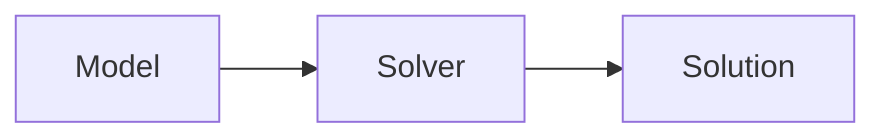

# Lecture Digest

Converts a set of lecture videos + slides into one **layered digest** per lecture:
a document engineered to be read *instead of* watching, at 2–3x the speed, without
losing anything that mattered.

The human supplies links and slides. You do everything else.

Paths and policies come from the consuming repo's `.claude/wiki-schema.md` — see the
configuration table in `wiki_ingest`. This skill reads `wiki_root`, `source_policy`,
`raw_dir`, and `domains`.

---

## The governing principle

Follow the repo's writing style guide at `CLAUDE.md` for voice, sentence construction, and
formatting. It applies to digest prose. The rules below govern *what goes in* a digest; that
file governs *how it reads*.

**Restructure, don't compress.**

Lectures run ~130 wpm; reading runs 250+. A *full-fidelity* linear document already
beats watching by 2–3x before a single word is cut. Cutting is where fidelity dies,
and you don't need to cut to get the speedup.

So: never summarise a worked example, an algorithm trace, or a formal definition.
Reproduce them. Compress only redundancy — restated points, admin chatter, filler.
Length is not the enemy; unstructured length is.

Three rules follow from this:

1. **Prose spine, not bullets.** Bullet-shredding strips the causal and contrastive
   connective tissue ("we need heuristics *because* blind search blows up here") —
   which is exactly what transfers to unseen exam questions. Write tight paragraphs.
   Bullets are for genuine lists only: enumerated properties, algorithm steps, options.
2. **Anchor everything.** Every spine section carries slide numbers and a clickable
   timestamp. This makes not-watching *safe* — any claim you distrust is one click
   from the source. Fidelity becomes recoverable rather than lost.
3. **Surface the transcript-only material.** What the lecturer said but didn't put on
   a slide — intuitions, "this trips people up", worked reasoning, exam hints — is the
   only real reason to watch. Extract it explicitly and mark it, and the reason evaporates.

---

## Pipeline

Work through in order. Don't stop for confirmation between steps unless you hit a
genuine ambiguity — the human wants to see the full result, then discuss.

### Step 1 — Collect inputs

Establish, per lecture: the video URL(s), the slide file(s), and a lecture label
(`l01`, `l02`, …). A single lecture is often **several short videos** plus one deck —
digest them together as one document, not one per video.

If the user points at a file of links (e.g. `<wiki_root>/<raw_dir>/l01-pre-lecture-youtube.md`),
read it. Strip YouTube tracking params (`&embeds_referring_origin=…`, `&source_ve_path=…`)
down to the bare `https://www.youtube.com/watch?v=<id>` before passing to the script.

### Step 2 — Pull transcripts

```bash
python3 "${CLAUDE_PLUGIN_ROOT}/skills/lecture-digest/scripts/fetch_transcript.py" \
  "<url>" "<url>" ... --out-dir <transcript-dir>
```

`<transcript-dir>` depends on `source_policy`. Under `archive-raw`, write to
`<wiki_root>/<raw_dir>/<label>-transcripts` and keep the transcripts — they are archived
source material like any other original. Under `link-only`, write to a scratch directory
outside the repo (`$TMPDIR/<label>-transcripts` is fine) and do not commit them. A
lecture transcript is closer to the source material than a summary is, so under that
policy it is exactly the artifact that must not land in the repo. The digest you write
from it is original prose either way; the transcript is working material.

Writes one `<video-id>.transcript.md` per video: YAML frontmatter (title, duration,
caption kind, word count) then timestamp-anchored paragraphs, each stamp a clickable
deep link into the video.

The script prefers human-authored captions and falls back to auto-generated. It
de-duplicates YouTube's rolling auto-caption overlap — without that, word counts
roughly double and timestamps drift. Sanity check the reported rate: **~130–160 wpm
is right**. ~300 wpm means dedupe failed; investigate before continuing.

`--chunk-seconds N` (default 45) controls paragraph granularity.

> [!warning] Auto-captions mangle technical terms and names
> Observed in practice: "Ni Povitzki" → Nir Lipovetzky, "dharmmouth" → Dartmouth,
> "peratron" → Perceptron, "polomial" → polynomial. **The slides are ground truth**
> for all names, notation, and terminology. Never propagate a transcript spelling of
> a technical term into the digest without checking it against the deck. When a term
> appears only in the transcript, flag it as `(sp?)` rather than guessing.

### Step 3 — Read the slides

Use the `pdf` skill to extract text per page. Also **view** pages that carry diagrams,
state-space figures, algorithm pseudocode, or tables — those are usually the load-bearing
content in a technical subject and never survive text extraction.

Record, per slide: its number, title, and what it actually asserts. You need slide
numbers for the anchors in Step 5.

### Step 4 — Align the two streams

Build a mapping from slide ranges to transcript spans. The lecturer moves through the
deck roughly linearly, so match on terminology and worked-example content.

Classify every piece of material:

| Source | Meaning | Treatment |
|---|---|---|
| Slides only | Formal definitions, notation, pseudocode | Reproduce verbatim; the deck is authoritative |
| Both | The core argument | Spine prose, slide notation + lecturer's explanation |
| Transcript only | Intuitions, asides, warnings, exam hints | Reproduce and **mark** with a `[!mic]` callout |

The transcript-only set is the highest-value output of this skill. Hunt for it deliberately.

### Step 5 — Write the digest

Write `<wiki_root>/sources/<label>-<topic-kebab>.summary.md` following the template
below. It must satisfy `.claude/wiki-schema.md`'s source-summary requirements (that
schema is authoritative — re-read it if unsure) *and* the layered structure.

### Step 6 — Hand off

Invoke `wiki_ingest` on the finished digest for concept/entity extraction, index and
log updates. Then run `wiki_lint`. Do not duplicate that work by hand — the digest is
the source summary those skills expect.

Mention to the user that `cue-cards` can turn the digest into a spaced-repetition
deck, but don't run it unasked.

---

## Digest template

Obsidian-native markdown throughout — callouts, LaTeX, mermaid, tables, footnotes.
No plugins required. Foldable callouts (`-` suffix) hide answers until clicked, which
is what makes the recall layer genuine retrieval practice rather than rereading.

````markdown
---
source: <video URLs + slide filename>
date_ingested: <YYYY-MM-DD>
type: lecture
domain: <required when `domains` is non-empty; omit otherwise>
tags: [<topic>, ...]
status: complete
---

# <Lecture label> — <Topic>

> [!abstract] Orientation — read this first (~1 min)
> **The problem this lecture solves.** One or two sentences: what you couldn't do
> before this material, and what you can do after.
>
> **Core claims**
> 1. …  (5–8 claims, each a full sentence that asserts something, not a topic label)
>
> **Prerequisites.** [[concept]], [[concept]] — what you must already hold.
> **Where it sits.** How this follows from the previous lecture and sets up the next.
> **Sources.** N videos (MM min total) + deck (N slides) · **digest read time ~X min**

---

## The Spine

Linear prose in the lecture's own order. Every `###` section anchored:

### <Section title>
`slides 12–18` · [`14:20`](https://www.youtube.com/watch?v=<id>&t=860s)

Tight paragraphs carrying the argument. Formal definitions reproduced exactly as
the slides state them, in LaTeX:

$$h(n) \leq h^*(n) \quad \forall n$$

Algorithm pseudocode reproduced in full, never paraphrased:

```
function A-STAR(problem, h):
    ...
```

> [!example] Worked example — <name>
> Reproduced **completely**, every step. Never compressed. In an algorithms subject
> the trace *is* the content; a summarised trace teaches nothing.

> [!mic] Not on the slides — <timestamp link>
> Lecturer-only material, quoted or closely paraphrased. Intuitions, warnings about
> common errors, exam hints. `mic` and `exam` are the only custom callout types used;
> without the CSS snippet they render as default note callouts, so digests stay
> readable either way. Everything else in this template is native Obsidian.

Use mermaid where a relationship is structural rather than verbal:



Use tables for genuine comparisons across a fixed set of dimensions.

---

## Recall Layer

> [!question]- Question stated so the answer is genuinely retrievable, not guessable
> The answer, with a `slides N` / timestamp pointer back to the spine.

8–15 questions covering every core claim. Fold them (`-`) so answers stay hidden.
Ask *why* and *when-does-this-break*, not just *what is*.

> [!failure] Common failure modes
> Errors this material invites — direction-of-implication mistakes, assumption slips,
> notation confusions. Draw from the lecturer's warnings where available.

> [!exam] Exam surface
> What this lecture plausibly gets examined on, and in what form.

> [!todo] Open threads
> Genuinely unresolved after this lecture: deferred to a later lecture, stated without
> proof, or unclear in the source. Be honest — this is where you flag your own gaps.

---

## Topics covered

Exhaustive checklist mapping every slide range to its spine section, so nothing in the
deck is silently dropped. Required by `.claude/wiki-schema.md`.

- [ ] `slides 1–8` — … → [[#Section]]

## Connections

`See also:` [[concept]], [[sources/<other>.summary]]
````

---

## Quality bar

Before handing off, verify:

- [ ] Every spine section has both a slide range and a working timestamp link.
- [ ] Every worked example and every piece of pseudocode is complete, not summarised.
- [ ] Every technical term and proper noun checked against the slides, not the transcript.
- [ ] Transcript-only material is present and marked — if you found none, you didn't look.
- [ ] Recall questions are foldable and cover all core claims.
- [ ] Topics-covered checklist accounts for every slide in the deck.
- [ ] Formalism renders: `$…$` inline, `$$…$$` block, mermaid fenced.
- [ ] `wiki_lint` passes.

**The test:** could the user skip the video entirely, read this, and lose nothing but
time? If any part of the lecture exists only in the video, the digest has failed.
